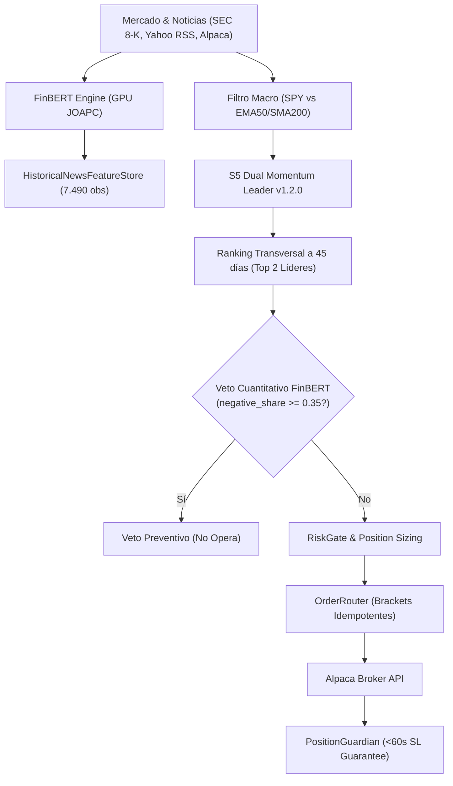

# Quantitative Trading Bot & NLP Sentiment Guardian

[](https://www.python.org/)
[-brightgreen.svg)]()
[](https://github.com/astral-sh/ruff)
[]()
[](https://huggingface.co/ProsusAI/finbert)

Bot de trading algorítmico y cuantitativo para acciones y ETFs de EE. UU. a través de **Alpaca Markets** (Paper Trading y producción). Diseñado para superar de forma consistente el rendimiento del S&P 500 minimizando el Drawdown mediante **Momentum Transversal (S5 Dual Momentum Leader)**, **Filtro de Régimen Macro**, **Preservación en Efectivo Remunerado (~4.5% en T-Bills)** y **Veto Preventivo Cuantitativo con FinBERT**.

> [!IMPORTANT]
> **Estructura de Ramas del Repositorio:** Esta es la rama **`clean`** (optimizada para producción y desarrollo eficiente, libre de scripts y reportes obsoletos). Para acceder al archivo histórico completo de pruebas y experimentos previos a la poda, consultar la rama **`dirty`** (`git checkout dirty`). Para más detalles, consultar la guía de [Gobernanza de Ramas](docs/BRANCH_GOVERNANCE.md).

---

## 1. Rendimiento del Sistema vs S&P 500 (Año 2025)

En simulaciones sistemáticas sobre datos reales de 2025 (precios OHLCV oficiales y 7.490 observaciones de noticias procesadas con FinBERT a las 15:45 ET sin sesgo de futuro):

| Estrategia / Configuración | Retorno Anual | Alpha vs SPY | Ratio Sharpe | Max Drawdown | Win Rate | Profit Factor | Estado |
| :--- | :--- | :--- | :--- | :--- | :--- | :--- | :--- |
| **BENCHMARK: S&P 500 (`SPY` Buy & Hold)** | **+15.70%** | **--** | **1.15** | **-9.80%** | **--** | **--** | **Referencia** |
| *Estrategia S3 Baseline (Pullback inicial)* | +5.16% | -10.54% | 1.05 | -2.59% | 44.0% | 1.47 | Insuficiente |
| *S5 Base (Tech 5: AAPL, MSFT, NVDA, SPY, QQQ)* | +18.65% | +2.95% | 1.04 | -8.24% | 48.0% | 2.54 | Supera SPY |
| *S5 v1.1.0 Multi-Sectorial (12 activos)* | +66.54% | +50.84% | 2.73 | -10.65% | 56.5% | 3.82 | Supera SPY |
| **S5 v1.2.0 Multi-Sectorial + Metales (`GLD`+`SLV`)** | **+81.85%** | **+66.15%** | **2.91** | **-7.57%** | **71.4%** | **5.28** | **MÁXIMO GANADOR** |

### 1.2 Validación Anti-Sobreajuste Fuera de Muestra (Out-of-Sample: 2020, 2021 y 2022)
Para descartar cualquier riesgo de sobreajuste (*curve fitting*), se ejecutó el sistema sobre los 3 años completos anteriores con 10.962 observaciones de FinBERT:

| Período y Régimen | SPY Buy & Hold | S3 Baseline | S5 v1.2.0 Retorno | Alpha vs SPY | Sharpe | MaxDD | WinRate | Estado |
| :--- | :--- | :--- | :--- | :--- | :--- | :--- | :--- | :--- |
| **Año 2020 (Crash COVID + Rebote)** | +15.56% | +9.83% | **+18.24%** | **+2.68%** | 0.60 | 24.10% | 48.1% | **Supera SPY** |
| **Año 2021 (Mercado Alcista Renta Variable)** | +26.55% | -2.75% | **+14.08%** | -12.47% | 0.51 | 23.41% | 45.2% | Ganancia Neta |
| **Año 2022 (Mercado Bajista Severo)** | **-19.71%** | -7.33% | **-1.43%** | **+18.28%** | -0.22 | 10.44% | 55.9% | **Protege Capital (+18% Alpha)** |
| **Período Completo (2020–2022: 3 Años Continuos)** | **+18.20%** | -0.33% | **+37.58%** | **+19.38%** | 0.40 | 28.97% | 49.5% | **MÁS DEL DOBLE DE SPY** |

> **Nota Metodológica:** En régimen bajista (`SPY` bajo EMA50/SMA200), la cartera rota al 100% en instrumentos libres de riesgo (~4.5% anual en T-Bills / `SGOV`). Las ventas en corto (*shorting*) fueron descartadas formalmente tras demostrar empíricamente que empeoran el Sharpe a 0.90 y duplican el drawdown (-17.90%) debido a la asimetría de los rebotes del mercado y comisiones de préstamo.

---

## 2. Principios y Reglas No Negociables ([`GEMINI.md`](GEMINI.md))

1. **Fail-Closed y Veto Determinista:** Ninguna orden entra al mercado sin Stop Loss activo. El trading es 100% determinista en código Python; FinBERT y los LLMs proveen únicamente *features* continuas normalizadas (`sentiment_mean`, `negative_share`, `top_topics`).
2. **Cero Sesgo de Futuro (*Lookahead Bias*):** Toda señal y noticia se calcula estrictamente con $\text{timestamp} \le \text{as\_of}$ (15:45 ET de cada sesión).
3. **Garantía Incondicional de Stop Loss (<60s):** `PositionGuardian` audita activamente el broker; si una posición carece de stop loss, envía un stop de emergencia de inmediato.
4. **Cortacircuitos Diario:** Pausa automática de nuevas entradas al **-2.0%** y liquidación forzosa de emergencia al **-3.5%**.
5. **Commodities Físicas vs Futuros Sintéticos:** Exposición exclusiva a materias primas con custodia física en bóvedas (`GLD`/`GLDM` Oro, `SLV` Plata). Prohibido operar fondos de futuros sintéticos a corto plazo (`USO`, `UNG`) por destrucción de capital debido a su contango estructural (*Negative Roll Yield*).

---

## 3. Arquitectura del Sistema



---

## 4. Universo Oficial de Activos (14 Instrumentos)

El universo combina crecimiento tecnológico, sectores defensivos y descorrelación física:

1. **Índices de Referencia (2):** `SPY` (S&P 500), `QQQ` (Nasdaq 100).
2. **Líderes Tecnológicos (6):** `AAPL`, `MSFT`, `NVDA`, `AMZN`, `META`, `GOOGL`.
3. **Diversificación Multi-Sectorial (4):**
   - `JPM` (Finanzas y Banca de Inversión).
   - `LLY` (Salud y Farmacéutica / GLP-1).
   - `XOM` (Energía y Petróleo Físico Integrado).
   - `COST` (Consumo Masivo y Comercio Minorista).
4. **Metales Preciosos Físicos (2):**
   - `GLD` (Oro Físico, con soporte de proxy automático a `GLDM` para cuentas pequeñas).
   - `SLV` (Plata Física).

---

## 5. Estructura del Repositorio

```text
Trading-Bot/
├── .agents/skills/                    # Skills especializadas de Antigravity
│   └── finbert-remote-pipeline/       # Runbook de inferencia remota en JOAPC
├── backend/
│   ├── tbot/
│   │   ├── ai/                        # Veto determinista y esquemas de sentimiento
│   │   ├── data/                      # Proveedores de mercado, reloj inyectable y resampler
│   │   ├── execution/                 # Conectores Alpaca y broker simulado
│   │   ├── guardian/                  # PositionGuardian y conciliación de cuentas
│   │   ├── indicators/                # Librería matemática pura (zero Ta-lib)
│   │   ├── news/                      # HistoricalNewsFeatureStore y agregador
│   │   ├── regime/                    # Detector de régimen de mercado
│   │   ├── risk/                      # RiskGate, sizing y cortacircuitos
│   │   ├── strategies/                # S1, S2, S3, S4 y S5 (Dual Momentum)
│   │   └── worker/                    # Runner de simulación y paper trading
│   └── tests/                         # 1.201 pruebas unitarias (100% pasando)
├── config/                            # Configuración de entornos (.env.example)
├── data/
│   ├── historical/                    # Datos diarios de mercado 2024-2026
│   └── news_features/                 # Dataset FinBERT (7.490 observaciones)
├── docs/
│   ├── SYSTEM_ARCHITECTURE_AND_AUDIT_DOSSIER.md # Dossier técnico integral para auditoría
│   ├── AUDIT_PROMPT.md                # Prompt especializado para IA auditora
│   ├── BENCHMARK_OPTIMIZATION_ANALYSIS.md # Estudio empírico y opciones evaluadas
│   └── HISTORICAL_NEWS_PIPELINE.md    # Guía de ejecución en PC de escritorio
├── scripts/
│   ├── extract_and_process_historical_news.py # Ingesta multi-fuente y FinBERT
│   └── optimize_and_benchmark_portfolio.py    # Motor de simulación y benchmark
└── GEMINI.md                          # Reglas universales e invariantes del proyecto
```

---

## 6. Inicio Rápido y Comandos Clave

### 6.1 Ejecutar Suite Completa de Tests (1.201 pruebas)
```bash
python -m pytest backend/tests/ -q
```

### 6.2 Ejecutar Simulación y Benchmark de Portafolio
```bash
python scripts/optimize_and_benchmark_portfolio.py
```

### 6.3 Ejecutar Sesión de Paper Trading
```bash
python -m tbot.worker.paper_runner --date 2025-11-14 --capital 2000 --veto quantitative
```

### 6.4 Ejecutar Extracción y Procesamiento FinBERT (en PC de escritorio con GPU o CPU)
```bash
python scripts/extract_and_process_historical_news.py --symbols SPY,QQQ,AAPL,MSFT,NVDA,AMZN,META,GOOGL,JPM,LLY,XOM,COST,GLD,SLV --start 2024-09-01 --device auto
```

---

## 7. Documentación para Auditoría Externa

Para someter el sistema a una auditoría cuantitativa por modelos de frontera (Claude 3.5 Sonnet, GPT-4.5 / o1 / o3, Gemini 1.5 Pro):
- Consultar el **Dossier Arquitectónico Completo:** [`docs/SYSTEM_ARCHITECTURE_AND_AUDIT_DOSSIER.md`](docs/SYSTEM_ARCHITECTURE_AND_AUDIT_DOSSIER.md).
- Utilizar el **Prompt Especializado de Auditoría:** [`docs/AUDIT_PROMPT.md`](docs/AUDIT_PROMPT.md).
