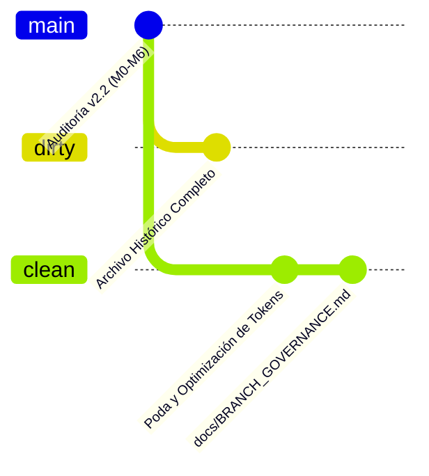

# Gobernanza de Ramas: `clean` (Producción) vs `dirty` (Archivo Histórico)

> **Fecha de Creación:** 2026-09-22  
> **Área:** Arquitectura y Gobernanza del Repositorio Trading-Bot  
> **Estado:** Activo y Vinculante  

---

## 1. Justificación y Propósito del Recorte

Tras la culminación exitosa de los hitos **M0 a M6** de la auditoría cuantitativa v2.2 (con una reducción demostrada de la Probabilidad de Sobreajuste de Backtest de **$PBO = 84.45\%$ a $0.00\%$** y validación en holdout fuera de muestra), el repositorio acumulaba un volumen significativo de artefactos exploratorios transitorios:
- 40 scripts de prueba, benchmarks preliminares y arneses obsoletos.
- 21 reportes intermedios, notas de cableado y diagnósticos puntuales.
- Documentos de planificación preliminares (como `PLAN.md` de 70 KB) y auditorías previas superadas (v1.2, v2.0, v2.1).
- Directorios temporales de diagnóstico (`scratch/` y `backtest_results/` con sesgo retrospectivo).

Este lastre consumía una cantidad desproporcionada de tokens de contexto en cada interacción con agentes de inteligencia artificial y aumentaba la fricción cognitiva de mantenimiento del código.

Para resolver esto de forma irreversible y segura, **se ha ejecutado una poda exhaustiva**, separando el repositorio en dos ramas con propósitos claramente delimitados: **`clean`** y **`dirty`**.

---

## 2. Definición y Roles de las Ramas



### 2.1 Rama `clean` (Rama Oficial de Producción y Desarrollo Futuro)
- **Propósito:** Es la rama operativa activa del proyecto a partir de este momento.
- **Contenido:**
  * **Núcleo de Producción:** [`backend/tbot/`](file:///d:/Github%20Repositories/Trading-Bot/backend/tbot) con el motor unificado de simulación (`BacktestEngine`), estrategias activas (S5 Top-4, S8 PID), filtros de régimen, modelo de costos minoristas y cortacircuitos deterministas.
  * **Suite de Pruebas Automatizadas:** 1.677 tests unitarios y adversariales pasando al 100% en verde.
  * **Scripts Esenciales:** Únicamente herramientas activas de ingesta de datos, recálculo de DSR/PBO, atribución multifactorial y evaluación de holdout.
  * **Dossier de Reportes Institucionales:** Los 8 reportes oficiales definitivos (`final_holdout.md`, `deflated_sharpe_and_pbo.md`, `engine_unification.md`, `s5_universe_a_30d.md`, `hourly_s6_s8_backtest.md`, `overnight_vs_intraday_decomposition.md`, `multifactor_attribution.md`, `rank_monotonicity.md`).
  * **Gobernanza:** [`data/HOLDOUT_LOCK.md`](file:///d:/Github%20Repositories/Trading-Bot/data/HOLDOUT_LOCK.md) y [`docs/LEDGER.md`](file:///d:/Github%20Repositories/Trading-Bot/docs/LEDGER.md).

### 2.2 Rama `dirty` (Rama de Archivo Histórico)
- **Propósito:** Preservar intacto el 100% del historial, experimentos descartados, scripts exploratorios y registros de auditorías anteriores.
- **Acceso:** Si algún desarrollador, auditor o investigador necesita revisar:
  * Scripts de prueba transitorios (ej. pruebas de movilidad de capital, pruebas de granularidad de Universo A, probes de cortacircuitos).
  * Reportes intermedios de las auditorías v1.0 a v2.1.
  * El código de ablación y extracción de noticias de FinBERT archivado.
  * Los scripts de diagnóstico de `scratch/`.

  **DEBE HACER CHECKOUT DE LA RAMA `dirty`:**
  ```powershell
  git checkout dirty
  ```
  En la rama `dirty` **no se ha borrado absolutamente nada**; todo el trabajo histórico se conserva de manera inmutable.

---

## 3. Resumen de Archivos Podados en `clean`

| Componente | Estado Anterior (`dirty`) | Estado Podado (`clean`) | Reducción de Archivos / Complejidad |
| :--- | :---: | :---: | :---: |
| **Scripts (`scripts/`)** | 40 scripts | 17 scripts | **-57.5%** (eliminados 23 scripts redundantes/obsoletos) |
| **Reportes (`reports/`)** | 21 reportes | 8 reportes canónicos | **-61.9%** (eliminados 13 reportes intermedios) |
| **Documentación (`docs/`)** | 17 documentos | 9 documentos esenciales | **-47.0%** (eliminados planes v2.0 y logs v1.2/v2.1) |
| **Scratch (`scratch/`)** | 4 scripts + pycache | 0 (eliminado por completo) | **-100.0%** |
| **Resultados Antiguos (`backtest_results/`)** | 7 reportes con sesgo v1 | 0 (eliminado por completo) | **-100.0%** |

---

## 4. Guía para Nuevos Desarrolladores y Agentes IA

1. **Trabajar Siempre en `clean`:** Todas las nuevas funcionalidades, refactorizaciones y monitoreo de paper trading deben basarse en `clean`.
2. **No Re-crear Scripts Descartados:** Antes de escribir una prueba rápida, consultar `docs/LEDGER.md` o revisar `dirty` para comprobar si esa hipótesis ya fue evaluada empíricamente.
3. **Mantener la Disciplina del Ledger:** Si se formula una nueva hipótesis o variación de estrategia, debe pre-registrarse en `docs/LEDGER.md` antes de ejecutar cualquier simulación.
