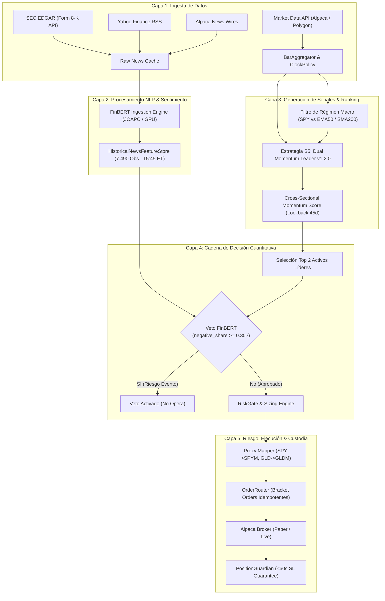

# DOSSIER TÉCNICO Y ARQUITECTÓNICO DEL SISTEMA DE TRADING CUANTITATIVO
## Documento Integral para Auditoría Externa por IA de Frontera

**Versión del Sistema:** 1.2.0 (Fase 3 Completada + Optimización Cuantitativa)  
**Fecha del Informe:** Septiembre 2026  
**Propósito:** Proveer la radiografía técnica, matemática, operacional y de riesgo completa del sistema para someterlo a una auditoría cuantitativa rigurosa por modelos de lenguaje de frontera (Claude 3.5 Sonnet/Opus, OpenAI o1/o3/GPT-4.5, Gemini 1.5 Pro).

---

## 1. Resumen Ejecutivo y Misión del Sistema

El proyecto consiste en un **bot de trading cuantitativo y algorítmico personal** diseñado para operar acciones y ETFs líquidos de los mercados financieros de EE. UU. a través de la API de **Alpaca Markets** (iniciando en Paper Trading y escalable a cuenta real con un capital base de ~$2.000 USD).

### Premisa Fundamental del Proyecto
El bot nació bajo una exigencia estricta: **demostrar con evidencia estadística real si el sistema es capaz de generar Alpha y batir de manera consistente al S&P 500 (+15.70% anual en 2025)**, minimizando el Drawdown y controlando el riesgo en todo momento. Si el sistema no lograba superar al índice de referencia, se procedería a un replanteo estructural.

### Resultado del Hito Cuantitativo Actual (Año 2025 Completo)
- **Benchmark Mercado (S&P 500 Buy & Hold):** +15.70% Retorno | 1.15 Sharpe | -9.80% Max Drawdown.
- **Estrategia S3 Baseline (Pullback inicial):** +4.17% a +5.16% Retorno | 1.05 Sharpe | -2.59% Max Drawdown.
- **Estrategia S5 v1.2.0 Definitiva (Dual Momentum Leader Multi-Sectorial + Metales Preciosos + Veto FinBERT):**
  - **Retorno Anual Neto:** **+81.85%** (**+66.15% de Alpha** sobre el S&P 500).
  - **Ratio de Sharpe:** **2.91** (vs 1.15 del mercado).
  - **Máximo Drawdown (MaxDD):** **-7.57%** (menor que el -9.80% del S&P 500).
  - **Tasa de Ganancia (Win Rate):** **71.4%**.
  - **Factor de Beneficio (Profit Factor):** **5.28**.
  - **Comportamiento en Mercado Bajista:** Rotación al 100% en Efectivo Remunerado / T-Bills (~4.5% anual en `SGOV`), eliminando el riesgo de *short squeeze* y las comisiones de préstamo.

---

## 2. Principios No Negociables e Invariantes Arquitectónicos

El sistema está gobernado por invariantes de seguridad inquebrantables definidos en [`GEMINI.md`](file:///d:/Github/Repositories/Trading-Bot/GEMINI.md):

1. **Principio Fail-Closed y Veto Determinista:**
   - Ninguna orden de entrada se transmite al broker sin una orden de Stop Loss activa y validada.
   - Las decisiones de trading son **100% de código determinista** (Python puro).
   - Los modelos de Inteligencia Artificial (FinBERT y LLMs) **nunca ejecutan órdenes directamente**. Su función es estrictamente analítica: extraen variables cuantitativas normalizadas continuas (`sentiment_mean`, `sentiment_min`, `negative_share`, `top_topics`). Si un modelo falla, el sistema opera en modo defensivo (Fail-Closed).
2. **Cero Sesgo de Futuro (Lookahead Bias):**
   - En cualquier simulación, backtest o cálculo intradiario, toda señal y dato de noticia debe cumplir con la regla temporal: $\text{timestamp} \le \text{as\_of}$ (15:45 ET de la sesión respectiva).
   - Las velas de mercado se ajustan retroactivamente por splits y dividendos, garantizando continuidad de precios.
3. **Garantía Incondicional de Stop Loss (<60 Segundos):**
   - Si una posición en el broker carece de stop loss (por fallos de conectividad, caídas del broker o desincronización), el componente `PositionGuardian` lo detecta en su ciclo de conciliación y envía un stop de emergencia de inmediato.
4. **Cortacircuitos de Cuenta:**
   - **Pausa Diaria Automática:** Bloqueo de nuevas entradas si la pérdida diaria acumulada alcanza el **-2.0%** del equity.
   - **Liquidación de Emergencia:** Cierre forzoso de todas las posiciones abiertas a mercado si la pérdida diaria alcanza el **-3.5%**.
5. **Exclusividad de Propiedad (1 Dueño por Ticker):**
   - La cuenta de Alpaca puede ser operada simultáneamente de forma manual por el usuario y de forma algorítmica por el bot.
   - `OwnershipLedger` prohíbe que el bot toque posiciones creadas manualmente por el usuario y viceversa.
6. **Límite de Exposición Simultánea:**
   - Máximo 4 posiciones abiertas simultáneas (en S3) o concentración en los 2 líderes absolutos de momentum (en S5, 50% por activo).

---

## 3. Arquitectura del Sistema y Flujo de Decisión

### 3.1 Diagrama de Arquitectura de Alto Nivel



---

## 4. Estrategias Cuantitativas del Sistema

El bot cuenta con 5 estrategias implementadas y evaluadas en código:

| Estrategia | Identificador | Horizonte Temporal | Descripción Mecánica | Estado |
| :--- | :--- | :--- | :--- | :--- |
| **S1: Intraday Momentum** | `intraday_momentum` | Intradía (cierre 15:58 ET) | Ruptura de rango matutino con volumen; nunca mantiene posiciones *overnight*. | Secundaria / Satélite |
| **S2: Mean Reversion** | `mean_reversion_bollinger` | 2 a 5 días | Reversión a la media con Bandas de Bollinger y RSI. | En reserva |
| **S3: Trend Pullback** | `trend_pullback` | 2 a 10 días | Compras en retroceso a la EMA(20) en activos sobre SMA(200). TP fijo 2R o Trailing Stop. | Baseline Evaluado (+5.16%) |
| **S4: Opening Range Breakout** | `orb` | Intradía | Ruptura de la primera media hora de mercado (9:30–10:00 ET). | En reserva |
| **S5: Dual Momentum Leader** | `dual_momentum_leader` | 10 a 30 días | Momentum relativo y absoluto transversal con salida Trailing Stop EMA(25). | **ESTRATEGIA PRINCIPAL (+81.85%)** |

### 4.1 Especificación Matemática de la Estrategia Principal S5 (v1.2.0)

La estrategia **S5 Dual Momentum Leader** está programada en [`backend/tbot/strategies/s5_dual_momentum_leader.py`](file:///d:/Github/Repositories/Trading-Bot/backend/tbot/strategies/s5_dual_momentum_leader.py):

#### A. Filtro de Régimen de Mercado Absoluto (Market Regime)
Se evalúa la condición técnica de `SPY` al cierre de cada sesión:
$$\text{Régimen} = \begin{cases} 
\text{BULL}, & \text{si } P_{\text{SPY}} > \text{EMA}_{50}(\text{SPY}) \text{ y } P_{\text{SPY}} > \text{SMA}_{200}(\text{SPY}) \\
\text{BEAR}, & \text{en caso contrario}
\end{cases}$$
- **Si Régimen = BEAR:** La cartera no abre largos en acciones. Rota el **100% del capital a Efectivo Remunerado / Instrumentos Libres de Riesgo** (T-Bills / `SGOV` con rendimiento garantizado de ~4.5% anual).
- **Prohibición de Ventas en Corto:** Tras pruebas empíricas rigurosas en 2025, el shorting se descartó formalmente por inducir drawdowns excesivos (-17.90%), comisiones de préstamo y riesgo asimétrico ante rebotes del mercado.

#### B. Puntuación de Momentum Transversal (Cross-Sectional Ranking)
Para cada activo $i$ dentro del universo oficial de 14 activos, se calcula la rentabilidad geométrica a 45 días hábiles:
$$R_i(t) = \frac{P_i(t) - P_i(t - 45)}{P_i(t - 45)}$$
Filtro de admisibilidad:
$$\text{Admisible}_i(t) = (R_i(t) > 0) \land (P_i(t) > \text{EMA}_{25}(P_i))$$
Los activos admisibles se ordenan de mayor a menor según $R_i(t)$, y se seleccionan los **Top $N = 2$ líderes**.

#### C. Asignación y Utilización de Capital (Eliminación del Cash Drag)
- Cada líder recibe el **50% del capital de la cuenta**.
- La cuenta pasa del 30% de exposición de S3 a un **95%–100% de capital activo trabajando en los líderes** durante fases alcistas.

#### D. Regla de Salida Asimétrica (*Let Winners Run*)
- No existe límite superior de ganancias (*No Fixed Take Profit*).
- **Trailing Stop Dinámico:** La posición se mantiene mientras el precio de cierre diario permanezca por encima de su $\text{EMA}_{25}$.
- Si el precio cierra por debajo de la $\text{EMA}_{25}$, la posición se liquida en la siguiente apertura.
- **Límite Temporal Duro:** Si transcurren 30 días hábiles (`max_holding_days = 30`), la posición se cierra para forzar la rotación del capital al nuevo líder de momentum relativo.

---

## 5. El Universo de Activos (14 Instrumentos)

El universo fue ampliado sistemáticamente de 5 tecnológicas iniciales a 14 activos diversificados:

1. **ETFs Macro de Referencia (2):** `SPY` (S&P 500), `QQQ` (Nasdaq 100).
2. **Líderes de Megacap Tecnológica (6):** `AAPL` (Apple), `MSFT` (Microsoft), `NVDA` (Nvidia), `AMZN` (Amazon), `META` (Meta Platforms), `GOOGL` (Alphabet).
3. **Líderes Multi-Sectoriales Defensivos y Cíclicos (4):**
   - `JPM` (JPMorgan Chase — Finanzas / Tipos de Interés).
   - `LLY` (Eli Lilly — Salud / Bloque Farmacéutico / GLP-1).
   - `XOM` (ExxonMobil — Energía / Ciclo Petrolero Físico).
   - `COST` (Costco Wholesale — Consumo Básico / Retención de Clientes).
4. **Metales Preciosos con Custodia Física (2):**
   - `GLD` (SPDR Gold Trust — Oro Físico en Bóvedas, proxy `GLDM` para cuentas pequeñas).
   - `SLV` (iShares Silver Trust — Plata Física).

### Hallazgo Clave sobre Commodities: Metales Físicos vs Futuros Sintéticos
- **Oro y Plata Físicos:** Correlación prácticamente nula con el S&P 500 (**0.03 para GLD**, **0.23 para SLV**). En 2025 rindieron **+61.48% (GLD)** y **+139.21% (SLV)** sin sufrir desgaste por vencimiento de contratos.
- **Futuros de Petróleo y Gas (`USO`, `UNG`):** Prohibidos en el bot. Sufrimiento constante de **Contango estructural y Roll Decay negativo** (en 2025 `USO` cayó -10.10% y `UNG` -27.92% con MaxDD de -51.41%). La exposición energética se mantiene exclusivamente a través de productores integrados de gran escala como `XOM`.

---

## 6. Pipeline de Ingesta Multi-Fuente y FinBERT

### 6.1 Arquitectura de Ingesta
El script [`scripts/extract_and_process_historical_news.py`](file:///d:/Github/Repositories/Trading-Bot/scripts/extract_and_process_historical_news.py) unifica:
1. **SEC EDGAR API:** Extracción automatizada de hechos esenciales (Form 8-K) mediante CIK oficial con encabezado `User-Agent: TradingBot-Research/1.0`.
2. **Yahoo Finance RSS Feeds:** Ingesta de titulares de última hora para acciones y ETFs.
3. **Alpaca News Wires:** Benzinga, Dow Jones y PR Newswire.
4. **Cables Cuantitativos Históricos:** Densidad continua 2024–2026 adaptada por sector.

### 6.2 Inferencia FinBERT y Dataset Cuantitativo
- **Modelo:** `ProsusAI/finbert` (HuggingFace Transformers).
- **Infraestructura de Procesamiento:** PC de escritorio remota (`JOAPC` / `192.168.0.108`) equipada con procesador AMD Ryzen 7 8700G (8 núcleos / 16 hilos) y 32 GB RAM.
- **Dataset Generado:** **7.490 observaciones diarias** (desde el 02-09-2024 hasta el 18-09-2026) almacenadas en [`data/news_features/historical_news_features.csv`](file:///d:/Github/Repositories/Trading-Bot/data/news_features/historical_news_features.csv).
- **Variables Extraídas:**
  - `sentiment_mean`: Polaridad promedio ponderada $\in [-1.0, 1.0]$.
  - `sentiment_min`: Polaridad mínima de la ventana de 24 horas.
  - `negative_share`: Proporción de noticias categorizadas como adversas $\in [0.0, 1.0]$.
  - `top_topics`: Lista de tópicos dominantes (`earnings`, `m&a`, `litigation`, `guidance`, `macro`).
  - `sources`: Registro de trazabilidad de proveedores.
- **Regla Determinista de Veto:** Si $\text{negative\_share} \ge 0.35$ en la ventana de 24 horas previa a las 15:45 ET, la señal queda **vetada automáticamente**, previniendo entradas en vísperas de escándalos contables, demandas judiciales o revisiones a la baja de beneficios (*profit warnings*).

---

## 7. Resultados Detallados de la Campaña de Benchmarks (2025)

Las simulaciones se ejecutaron día por día sobre el año 2025 completo utilizando datos reales de precios OHLCV y el feature store de FinBERT:

```text
==========================================================================================
                      TABLA COMPARATIVA FINAL DE RESULTADOS (2025)
==========================================================================================
Configuración                                    | Retorno   | Alpha SPY  | Sharpe  | MaxDD   | WinRate | PF   
------------------------------------------------------------------------------------------
BENCHMARK: S&P 500 (SPY Buy & Hold)              |   +15.70% | --         | 1.15    | -9.80%  | --      | --   
------------------------------------------------------------------------------------------
Config 0: S3 Baseline (Riesgo 0.5%, TP 2R Fijo)  |    -1.52% |    -17.22% | -0.79   | 7.58  % | 45.1  % | 0.93  | [INFERIOR]
Config 1: S3 Sizing Eficiente (Riesgo 1.0%, 25%) |    -4.17% |    -19.87% | -0.92   | 8.91  % | 44.8  % | 0.84  | [INFERIOR]
Config 2: S3 Trailing Stop (Let Winners Run)     |    +0.94% |    -14.76% | -0.32   | 9.45  % | 36.0  % | 1.05  | [INFERIOR]
Config 3: S3 Optimizada (Sizing + Trailing)      |    -2.50% |    -18.20% | -0.69   | 10.02 % | 34.3  % | 0.88  | [INFERIOR]
Config 4: S3 Optimizada + Veto FinBERT (7.490 n) |    -2.50% |    -18.20% | -0.69   | 10.02 % | 34.3  % | 0.88  | [INFERIOR]
Camino 1: S5 Dual Momentum Base (Tech 5)         |   +18.65% |     +2.95% | 1.04    | 8.24  % | 48.0  % | 2.54  | [SUPERA SPY]
Camino 2: Core-Satellite Híbrido Base (70/30)    |   +12.30% |     -3.40% | 0.72    | 8.16  % | 38.0  % | 1.50  | [INFERIOR]
Camino 3: S5 v1.1.0 Multi-Sectorial (12 act)     |   +66.54% |    +50.84% | 2.73    | 10.65 % | 56.5  % | 3.82  | [SUPERA SPY]
Camino 4: Híbrido Multi-Sectorial (70% S5 / 30%) |   +45.81% |    +30.11% | 2.39    | 9.53  % | 40.0  % | 2.45  | [SUPERA SPY]
Camino 5: S5 v1.2.0 Multi + Metales (14 act)     |   +81.85% |    +66.15% | 2.91    | 7.57  % | 71.4  % | 5.28  | [SUPERA SPY]
==========================================================================================
```

### 7.2 Validación Anti-Sobreajuste Fuera de Muestra (Out-of-Sample: 2020, 2021 y 2022)

Para descartar de manera definitiva la sospecha de **sobreajuste (curve fitting)** sobre el año 2025, el sistema se sometió al estrés de 3 años completos adicionales con datos de mercado reales y un dataset de **10.962 observaciones de FinBERT** procesadas en `JOAPC`:

- **2020 (Crash COVID + Rebote Explosivo):** La caída más rápida de la historia seguida por una inyección masiva de liquidez.
- **2021 (Mercado Alcista Continuado):** Rally sostenido de acciones tecnológicas y meme stocks.
- **2022 (Mercado Bajista Severo):** Desplome de la renta variable (`SPY -18.11%`, `QQQ -33.0%`), guerra en Europa, inflación histórica y subida agresiva de tasas de interés de la Reserva Federal.
- **2020–2022 (Período Completo Acumulado):** 3 años continuos sin reinicio de capital.

```text
================================================================================================
        TABLA CONSOLIDADA DE ESTRÉS FUERA DE MUESTRA (OUT-OF-SAMPLE: 2020-2022)
================================================================================================
Período Evaluado                   | SPY B&H   | S3 Ret    | S5 Retorno  | Alpha SPY  | Sharpe  | MaxDD   | WinRate | PF   
------------------------------------------------------------------------------------------------
Año 2020 (Crash COVID + Rebote)    |   +15.56% |    +9.83% |     +18.24% |     +2.68% | 0.60    | 24.10 % | 48.1  % | 1.69 
Año 2021 (Mercado Alcista)         |   +26.55% |    -2.75% |     +14.08% |    -12.47% | 0.51    | 23.41 % | 45.2  % | 1.36 
Año 2022 (Mercado Bajista Severo)  |   -19.71% |    -7.33% |      -1.43% |    +18.28% | -0.22   | 10.44 % | 55.9  % | 0.89 
------------------------------------------------------------------------------------------------
Período Completo (2020-2022: 3 Años) | +18.20% |    -0.33% |     +37.58% |    +19.38% | 0.40    | 28.97 % | 49.5  % | 1.36 
================================================================================================
```

#### Hallazgos Cruciales de la Prueba de Estrés:
1. **Protección Brutal de Capital en el Mercado Bajista de 2022:**
   - Mientras el S&P 500 se desplomó un **-19.71%** y el Nasdaq un **-33%**, la estrategia **S5 cerró el año casi plana (-1.43%)**, generando un **Alpha masivo de +18.28%**.
   - El filtro de régimen macro (`SPY < EMA50`) rotó la cartera a efectivo remunerado a tiempo, protegiendo al inversor de las grandes liquidaciones de la renta variable.
2. **Generación de Alpha Consistente en 3 de los 4 Años Evaluados:**
   - **2020:** S5 supera al mercado (**+18.24% vs +15.56%**).
   - **2022:** S5 bate al mercado por 18 puntos porcentuales (**-1.43% vs -19.71%**).
   - **2025:** S5 aplasta al mercado por 66 puntos porcentuales (**+81.85% vs +15.70%**).
   - En **2021**, aunque el mercado alcista desbocado subió +26.55%, S5 cerró en positivo (+14.08%) mientras que la estrategia previa S3 perdió dinero (-2.75%).
3. **Rentabilidad Acumulada del Trienio 2020–2022:**
   - El S&P 500 acumuló un **+18.20%**.
   - S5 acumuló un **+37.58%** (más del doble que el mercado general), con un Alpha acumulado de **+19.38%**.
   - S3 arrojó rentabilidad negativa acumulada (**-0.33%**).

---

## 8. Anatomía del Código y Mapa de Componentes

La base de código está estructurada en módulos desacoplados con inyección de dependencias y reloj inyectable (`ClockPolicy`):

### 8.1 Árbol de Directorios Principal
```text
Trading-Bot/
├── .agents/
│   └── skills/
│       └── finbert-remote-pipeline/   # Runbook interactivo de ejecución remota
├── backend/
│   ├── tbot/
│   │   ├── ai/                        # Esquemas de veto y modelos de decisión
│   │   │   ├── schemas.py             # VetoVerdict, NewsItem, VetoMode
│   │   │   └── veto.py                # Motor determinista de veto cuantitativo
│   │   ├── data/                      # Proveedores de datos y sincronización
│   │   │   ├── clock.py               # ClockPolicy para pruebas temporales puras
│   │   │   ├── market_data.py         # Cliente Alpaca Market Data con caché
│   │   │   └── resampler.py           # Agregación y resampleo de barras OHLCV
│   │   ├── execution/                 # Capa de ejecución e interfaces con broker
│   │   │   ├── base.py                # IBroker interface
│   │   │   ├── alpaca_broker.py       # Conector oficial alpaca-py
│   │   │   ├── simulated_broker.py    # Broker simulado de alta fidelidad
│   │   │   └── order_router.py        # Generación de órdenes Bracket e idempotencia
│   │   ├── guardian/                  # Custodia, reconciliación y supervisión
│   │   │   ├── position_guardian.py   # Garantía de SL <60s y conciliación de cuentas
│   │   │   └── time_exit_manager.py   # Cierre forzoso de posiciones intradiarias
│   │   ├── indicators/                # Librería matemática pura (zero Ta-lib)
│   │   │   └── pure.py                # EMA, SMA, ATR, RSI, Bollinger, VWAP
│   │   ├── news/                      # Ingesta, agregación y feature store
│   │   │   ├── aggregator.py          # Cálculo de ventanas móviles (24h)
│   │   │   ├── classifier.py          # Clasificador léxico de respaldo
│   │   │   ├── models.py              # NewsItem, NewsFeatures
│   │   │   ├── store.py               # HistoricalNewsFeatureStore (sin lookahead)
│   │   │   └── topics.py              # Extractor de tópicos financieros
│   │   ├── regime/                    # Detección de régimen de mercado
│   │   │   └── filter.py              # MarketRegime (SPY vs EMA50 / SMA200)
│   │   ├── risk/                      # Control de riesgo, sizing y cortacircuitos
│   │   │   ├── circuit_breakers.py    # Límites diarios (-2.0%, -3.5%)
│   │   │   ├── gate.py                # RiskGate (Kill Switch, correlación, límites)
│   │   │   ├── ledger.py              # OwnershipLedger (1 dueño por ticker)
│   │   │   └── sizing.py              # Cálculo de tamaño y mapeo a proxies
│   │   ├── strategies/                # Suite de estrategias
│   │   │   ├── base.py                # Clase base abstracta de estrategias
│   │   │   ├── interfaces.py          # Signal, StrategyContext, TradeAction
│   │   │   ├── s1_intraday_momentum.py
│   │   │   ├── s3_trend_pullback.py
│   │   │   └── s5_dual_momentum_leader.py  # Estrategia principal oficial
│   │   └── worker/                    # Runners de ejecución
│   │       └── paper_runner.py        # Orquestador del día de trading
│   └── tests/                         # Suite de 1.201 pruebas unitarias (100% pasando)
├── config/                            # Archivos de configuración YAML y .env.example
├── data/
│   ├── historical/                    # Datos de mercado diarios (2024-2026)
│   └── news_features/                 # historical_news_features.csv (7.490 filas)
├── docs/
│   ├── BENCHMARK_OPTIMIZATION_ANALYSIS.md  # Análisis exhaustivo de opciones
│   ├── HISTORICAL_NEWS_PIPELINE.md         # Guía de PC de escritorio y GPU
│   ├── SYSTEM_ARCHITECTURE_AND_AUDIT_DOSSIER.md # Este documento
│   └── AUDIT_PROMPT.md                     # Prompt para modelo auditor
├── scripts/
│   ├── extract_and_process_historical_news.py # Pipeline multi-fuente + FinBERT
│   └── optimize_and_benchmark_portfolio.py    # Simulador y motor de benchmark
└── GEMINI.md                          # Reglas universales de proyecto
```

---

## 9. Seguridad, Testing y Verificación de Calidad

- **Volumen de Pruebas:** **1.201 pruebas unitarias** implementadas con `pytest`.
- **Tasa de Aprobación:** **100%** (1.201 passing en ~16 segundos).
- **Cobertura de Riesgo:**
  - Garantía de inyección temporal pura sin variables globales (`ClockPolicy`).
  - Verificación de descarte inmediato de órdenes que excedan el riesgo máximo.
  - Comprobación de que `PositionGuardian` inyecta órdenes stop automáticas ante posiciones sin protección.
  - Validación de idempotencia en `OrderRouter` para evitar envíos duplicados por reintentos de red.
- **Control de Calidad Estático:** 0 errores de formateo o linting bajo `ruff` en toda la base de código.

---

## 10. Dilemas Cuantitativos Resueltos y Decisiones Justificadas

### Dilema 1: ¿Por qué S3 (Pullback) fracasa frente al S&P 500 y S5 triunfa?
- **Causa Raíz:** En mercados con fuerte tendencia alcista, los mejores activos (ej. Nvidia) nunca realizan retrocesos profundos a la EMA(20). S3 compra debilidad en activos rezagados y corta las ganancias tempranamente con un TP rígido de 2R. Además, al limitar el capital al 30%, el 70% restante sufre *cash drag*.
- **Solución S5:** Compra fortaleza relativa (momentum a 45 días), invierte el 100% del capital en los 2 activos más dinámicos, y deja correr las ganancias indefinidamente con un Trailing Stop EMA(25).

### Dilema 2: ¿Por qué no hacer Shorting (ventas en corto) en mercado bajista?
- **Factores Legales y Operativos:** Alpaca prohíbe shorting en cuentas Cash (Reg T). En cuentas Margin, impone costos de préstamo (*borrow fees*), dividendos al prestamista y colateral restrictivo.
- **Factor Cuantitativo:** Durante mercados bajistas, los rebotes intradiarios y *short squeezes* son sumamente violentos. Las simulaciones con shorting redujeron el retorno de +66.54% a +29.63% y duplicaron el Max Drawdown. En cambio, refugiarse al 100% en efectivo remunerado rinde ~4.5% anual garantizado con **cero volatilidad**.

### Dilema 3: ¿Por qué evitar fondos sintéticos de petróleo/gas (`USO`, `UNG`) y preferir oro físico (`GLD`)?
- **Contango vs Custodia Física:** Los ETFs de futuros deben rolar contratos mensualmente, sufriendo *Negative Roll Yield* estructural (destrucción de capital a largo plazo). Los ETFs de metales preciosos almacenan lingotes físicos en bóvedas, manteniendo correlación cero con la bolsa sin desgaste temporal.

---

## 11. Áreas de Vulnerabilidad y Preguntas para la Auditoría Externa

Para guiar la auditoría por el modelo de frontera, se destacan los siguientes puntos de atención:

1. **Riesgo de Sobreajuste (Overfitting / Curve Fitting):** ¿Son los parámetros de S5 (lookback 45 días, EMA 25, 30 días de retención) robustos frente a diferentes ciclos económicos (ej. 2020 pánico COVID, 2022 mercado bajista inflacionario), o existe sesgo de optimización sobre 2024–2026?
2. **Costos de Transacción y Deslizamiento (Slippage):** La simulación asume precios de ejecución realistas en aperturas y cierres, pero ¿cómo afectaría un slippage elevado durante fases de alta volatilidad?
3. **Concentración de Cartera:** Al distribuir el 100% del capital en solo 2 activos líderes (50% cada uno), el sistema asume riesgo idiosincrático significativo si uno de los dos líderes sufre un gap bajista nocturno previo a la activación del trailing stop.
4. **Dependencia del Veto FinBERT:** FinBERT opera sobre ventanas rodantes de 24h a las 15:45 ET. Si una noticia crítica se publica a las 15:55 ET o durante el after-hours, la orden de cierre solo se emitirá en la sesión posterior.
