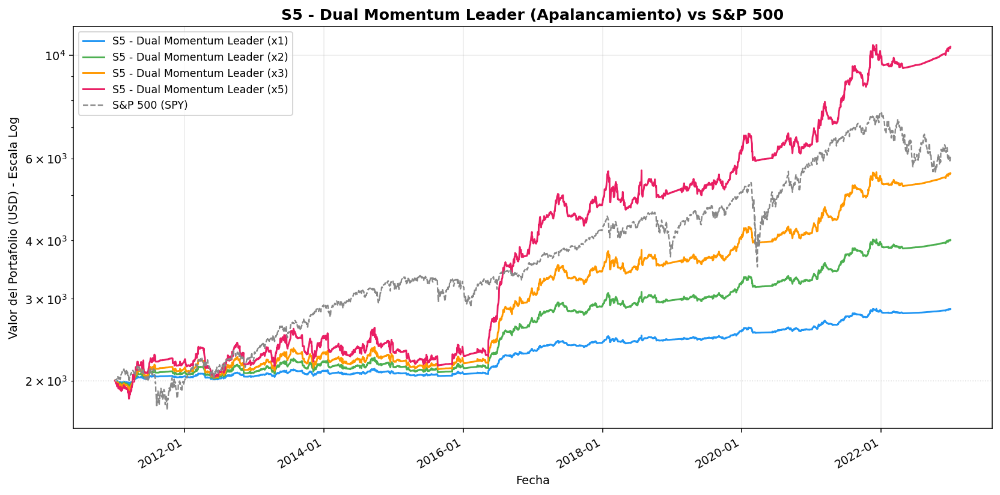
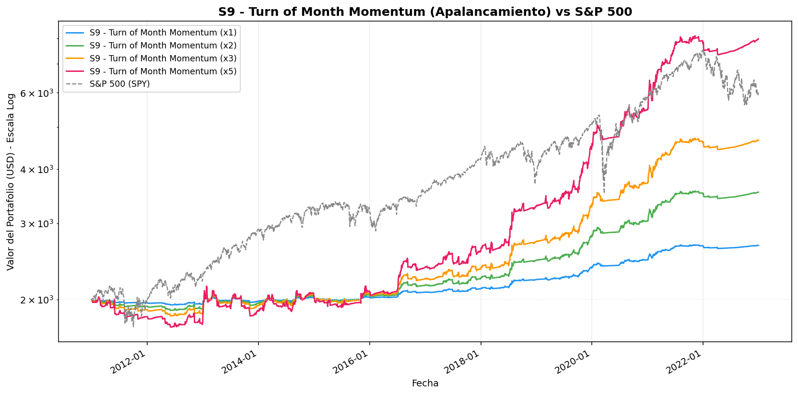
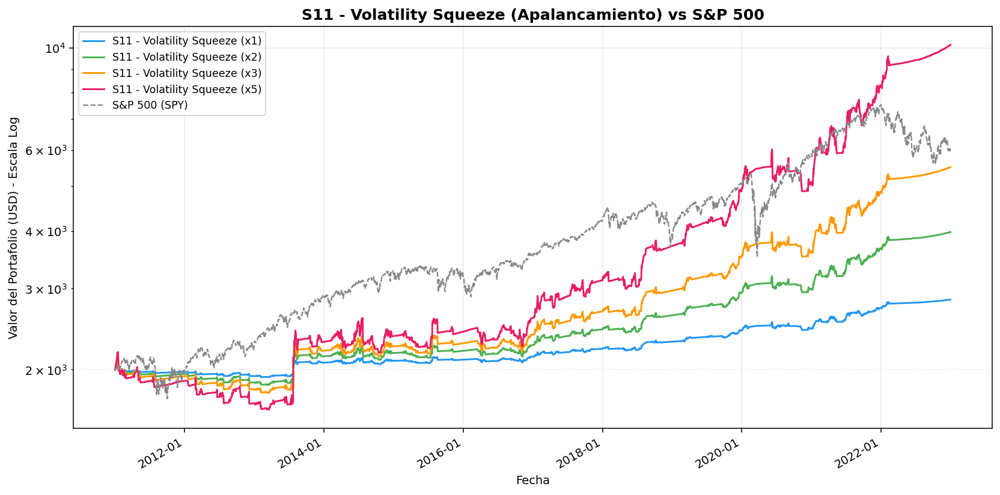

# 📈 Informe de Estrategias y Apalancamiento (x1, x2, x3, x5)
**Periodo:** 2011-01-03 a 2022-12-31
**Universo:** 14 Activos Principales (Tech, Finanzas, Salud, Energía, Metales)
**Capital Inicial:** $2,000.00 USD

> [!NOTE]
> La simulación de apalancamiento multiplica linealmente el retorno diario de la estrategia (sin descontar costos de margen/préstamo). Los resultados reales serían ligeramente menores debido a estos costos.

> **S&P 500 (SPY)** Retorno en el periodo: **201.01%**

## S5 - Dual Momentum Leader
| Apalancamiento | Retorno Total | Capital Final |
|---|---|---|
| **x1** | 42.43% | $2,848.54 |
| **x2** | 100.49% | $4,009.79 |
| **x3** | 178.93% | $5,578.60 |
| **x5** | 421.17% | $10,423.37 |

## S9 - Turn of Month Momentum
| Apalancamiento | Retorno Total | Capital Final |
|---|---|---|
| **x1** | 33.37% | $2,667.37 |
| **x2** | 76.89% | $3,537.78 |
| **x3** | 133.31% | $4,666.29 |
| **x5** | 299.22% | $7,984.32 |

## S11 - Volatility Squeeze
| Apalancamiento | Retorno Total | Capital Final |
|---|---|---|
| **x1** | 42.03% | $2,840.55 |
| **x2** | 99.09% | $3,981.79 |
| **x3** | 175.49% | $5,509.70 |
| **x5** | 407.62% | $10,152.41 |

