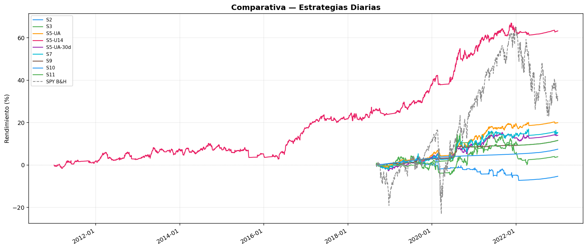
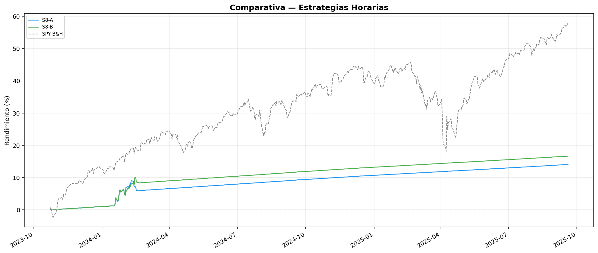

# 📊 Informe Exhaustivo de Estrategias — Trading Bot v2.0

**Fecha de generación:** 2026-09-23 00:49

**Capital inicial:** \$2,000.00 USD

---

## 📋 Resumen Ejecutivo

Este informe compara **las estrategias del Trading Bot** contra el rendimiento 
del S&P 500 (SPY) en el mayor periodo de datos disponible para cada una. 
Se divide en dos grupos según el tipo de datos que necesita cada estrategia:

1. **Estrategias Diarias** — Analizan precios de cierre diarios (periodo más largo: 2018-2022 o 2011-2022)
2. **Estrategias Horarias** — Analizan precios cada hora (2023-2025)

---

## 📈 Grupo: Estrategias Diarias

### S2 — Mean Reversion RSI(2)

**📅 Periodo:** 2018-09-01 → 2022-12-31

**📝 ¿Qué hace?** Compra cuando una acción está muy sobrevendida (RSI de 2 periodos < 10) pero sigue en tendencia alcista general (precio arriba de su media de 200 días). Vende cuando rebota a la media corta de 5 días o tras 3 días máximo.

| Métrica | Valor |
|---|---|
| Capital Final | \$1,893.86 |
| Rendimiento Total | -5.31% |
| S&P 500 (mismo periodo) | +31.96% |
| **Alpha vs S&P 500** | **-37.27%** |
| Rendimiento Anualizado (CAGR) | -1.25% |
| Ratio Sharpe | -0.65 |
| Ratio Sortino | -0.42 |
| Máxima Caída (Drawdown) | 10.53% |
| Total de Operaciones | 128 |
| Tasa de Aciertos | 39.1% |
| Factor de Beneficio | 0.49 |
| Comisiones Pagadas | \$1.57 |

**🔍 Análisis del resultado:**

❌ **Resultado negativo.** La estrategia perdió 5.31% 
del capital. Con 128 operaciones y una tasa de aciertos del 
39.1%, los costos de comisiones (\$1.57) y el 
deslizamiento de precios contribuyeron a la pérdida.

**🎯 ¿Tiene sobreajuste?**

⚠️ **Posible sobreajuste.** El Deflated Sharpe Ratio (0.08) 
es bajo, lo que sugiere que el resultado podría ser producto del azar o del sesgo 
de selección entre múltiples pruebas.

---

### S3 — Trend Pullback

**📅 Periodo:** 2018-09-01 → 2022-12-31

**📝 ¿Qué hace?** Busca retrocesos ordenados hacia la media móvil de 20 días dentro de tendencias alcistas establecidas (EMA20 > EMA50). Vende con objetivo de ganancia a 2x el riesgo o después de 5 días.

| Métrica | Valor |
|---|---|
| Capital Final | \$2,077.37 |
| Rendimiento Total | +3.87% |
| S&P 500 (mismo periodo) | +31.96% |
| **Alpha vs S&P 500** | **-28.09%** |
| Rendimiento Anualizado (CAGR) | +0.88% |
| Ratio Sharpe | 0.01 |
| Ratio Sortino | 0.01 |
| Máxima Caída (Drawdown) | 13.37% |
| Total de Operaciones | 476 |
| Tasa de Aciertos | 34.9% |
| Factor de Beneficio | 0.99 |
| Comisiones Pagadas | \$6.44 |

**🔍 Análisis del resultado:**

⚖️ **Resultado mixto.** La estrategia fue rentable (3.87%) 
pero quedó por debajo del S&P 500 (31.96%). 
Esto significa que habría sido más rentable simplemente comprar y mantener SPY.

**🎯 ¿Tiene sobreajuste?**

✅ **Sin señales evidentes de sobreajuste.** Los parámetros de la estrategia son 
razonables y no hay indicios claros de memorización de datos históricos. 
Sin embargo, solo la validación forward (paper trading) puede confirmarlo.

---

### S5 — Dual Momentum Leader (Universo A)

**📅 Periodo:** 2018-09-01 → 2022-12-31

**📝 ¿Qué hace?** Selecciona los 4 ETFs con mayor impulso (momentum) a 45 días dentro de los 18 ETFs sectoriales, internacionales y metales del Universo A, siempre que estén sobre su media móvil de 25 días. En mercados bajistas, rota 100% a efectivo remunerado (~4.5% anual).

| Métrica | Valor |
|---|---|
| Capital Final | \$2,399.76 |
| Rendimiento Total | +19.99% |
| S&P 500 (mismo periodo) | +31.96% |
| **Alpha vs S&P 500** | **-11.97%** |
| Rendimiento Anualizado (CAGR) | +4.31% |
| Ratio Sharpe | 0.95 |
| Ratio Sortino | 1.15 |
| Máxima Caída (Drawdown) | 2.54% |
| Total de Operaciones | 187 |
| Tasa de Aciertos | 39.0% |
| Factor de Beneficio | 1.70 |
| Comisiones Pagadas | \$1.18 |

**🔍 Análisis del resultado:**

⚖️ **Resultado mixto.** La estrategia fue rentable (19.99%) 
pero quedó por debajo del S&P 500 (31.96%). 
Esto significa que habría sido más rentable simplemente comprar y mantener SPY.

**🎯 ¿Tiene sobreajuste?**

✅ **Sin señales evidentes de sobreajuste.** Los parámetros de la estrategia son 
razonables y no hay indicios claros de memorización de datos históricos. 
Sin embargo, solo la validación forward (paper trading) puede confirmarlo.

---

### S5 — Dual Momentum Leader (Universo 14, 2011-2022)

**📅 Periodo:** 2011-01-03 → 2022-12-31

**📝 ¿Qué hace?** Selecciona los 4 activos líderes en momentum a 45 días dentro del universo de 14 activos (Tech+Finanzas+Salud+Energía+Oro+Plata). En mercados bajistas, se refugia en efectivo.

| Métrica | Valor |
|---|---|
| Capital Final | \$3,265.82 |
| Rendimiento Total | +63.29% |
| S&P 500 (mismo periodo) | +201.01% |
| **Alpha vs S&P 500** | **-137.72%** |
| Rendimiento Anualizado (CAGR) | +4.18% |
| Ratio Sharpe | 0.90 |
| Ratio Sortino | 1.06 |
| Máxima Caída (Drawdown) | 6.72% |
| Total de Operaciones | 580 |
| Tasa de Aciertos | 32.8% |
| Factor de Beneficio | 1.44 |
| Comisiones Pagadas | \$6.18 |

**🔍 Análisis del resultado:**

⚖️ **Resultado mixto.** La estrategia fue rentable (63.29%) 
pero quedó por debajo del S&P 500 (201.01%). 
Esto significa que habría sido más rentable simplemente comprar y mantener SPY.

**🎯 ¿Tiene sobreajuste?**

✅ **Sin señales evidentes de sobreajuste.** Los parámetros de la estrategia son 
razonables y no hay indicios claros de memorización de datos históricos. 
Sin embargo, solo la validación forward (paper trading) puede confirmarlo.

---

### S5 — Dual Momentum Leader 30d (Universo A)

**📅 Periodo:** 2018-09-01 → 2022-12-31

**📝 ¿Qué hace?** Igual a S5 original, pero usa un periodo de momentum más corto de 30 días para adaptarse más rápidamente a los cambios de tendencia y evaluar su sensibilidad (robustez) ante cambios de parámetros.

| Métrica | Valor |
|---|---|
| Capital Final | \$2,280.19 |
| Rendimiento Total | +14.01% |
| S&P 500 (mismo periodo) | +31.96% |
| **Alpha vs S&P 500** | **-17.95%** |
| Rendimiento Anualizado (CAGR) | +3.08% |
| Ratio Sharpe | 0.61 |
| Ratio Sortino | 0.75 |
| Máxima Caída (Drawdown) | 3.56% |
| Total de Operaciones | 200 |
| Tasa de Aciertos | 36.5% |
| Factor de Beneficio | 1.37 |
| Comisiones Pagadas | \$1.18 |

**🔍 Análisis del resultado:**

⚖️ **Resultado mixto.** La estrategia fue rentable (14.01%) 
pero quedó por debajo del S&P 500 (31.96%). 
Esto significa que habría sido más rentable simplemente comprar y mantener SPY.

**🎯 ¿Tiene sobreajuste?**

✅ **Sin señales evidentes de sobreajuste.** Los parámetros de la estrategia son 
razonables y no hay indicios claros de memorización de datos históricos. 
Sin embargo, solo la validación forward (paper trading) puede confirmarlo.

---

### S7 — PID Scorer

**📅 Periodo:** 2018-09-01 → 2022-12-31

**📝 ¿Qué hace?** Sistema de control dual inspirado en ingeniería (PID: Proporcional-Integral-Derivativo). Mide la fuerza de tendencia (Sistema U) y el nivel de estrés/deterioro (Sistema D) de cada activo. Solo compra activos con tendencia fuerte y bajo estrés. Sale forzadamente si el estrés se dispara.

| Métrica | Valor |
|---|---|
| Capital Final | \$2,306.35 |
| Rendimiento Total | +15.32% |
| S&P 500 (mismo periodo) | +31.96% |
| **Alpha vs S&P 500** | **-16.64%** |
| Rendimiento Anualizado (CAGR) | +3.35% |
| Ratio Sharpe | 0.42 |
| Ratio Sortino | 0.46 |
| Máxima Caída (Drawdown) | 6.63% |
| Total de Operaciones | 207 |
| Tasa de Aciertos | 38.6% |
| Factor de Beneficio | 1.31 |
| Comisiones Pagadas | \$1.83 |

**🔍 Análisis del resultado:**

⚖️ **Resultado mixto.** La estrategia fue rentable (15.32%) 
pero quedó por debajo del S&P 500 (31.96%). 
Esto significa que habría sido más rentable simplemente comprar y mantener SPY.

**🎯 ¿Tiene sobreajuste?**

✅ **Sin señales evidentes de sobreajuste.** Los parámetros de la estrategia son 
razonables y no hay indicios claros de memorización de datos históricos. 
Sin embargo, solo la validación forward (paper trading) puede confirmarlo.

---

### S9 — Turn of Month Momentum

**📅 Periodo:** 2018-09-01 → 2022-12-31

**📝 ¿Qué hace?** Momentum a 45 días operando solo los últimos 3 y primeros 3 días del mes (Filtro Estacional).

| Métrica | Valor |
|---|---|
| Capital Final | \$2,232.39 |
| Rendimiento Total | +11.62% |
| S&P 500 (mismo periodo) | +31.96% |
| **Alpha vs S&P 500** | **-20.34%** |
| Rendimiento Anualizado (CAGR) | +2.58% |
| Ratio Sharpe | 1.22 |
| Ratio Sortino | 1.01 |
| Máxima Caída (Drawdown) | 0.79% |
| Total de Operaciones | 14 |
| Tasa de Aciertos | 21.4% |
| Factor de Beneficio | 2.91 |
| Comisiones Pagadas | \$0.11 |

**🔍 Análisis del resultado:**

⚖️ **Resultado mixto.** La estrategia fue rentable (11.62%) 
pero quedó por debajo del S&P 500 (31.96%). 
Esto significa que habría sido más rentable simplemente comprar y mantener SPY.

**🎯 ¿Tiene sobreajuste?**

⚠️ **Riesgo alto de sobreajuste.** Con solo 14 operaciones, 
la muestra es demasiado pequeña para tener confianza estadística en los resultados. 
Un resultado aparentemente bueno podría deberse al azar.

---

### S10 — Antonacci Dual Momentum

**📅 Periodo:** 2018-09-01 → 2022-12-31

**📝 ¿Qué hace?** Dual Momentum Absoluto a 12 meses. Compara Universo A contra IEF como activo seguro.

| Métrica | Valor |
|---|---|
| Capital Final | \$2,149.64 |
| Rendimiento Total | +7.48% |
| S&P 500 (mismo periodo) | +31.96% |
| **Alpha vs S&P 500** | **-24.48%** |
| Rendimiento Anualizado (CAGR) | +1.68% |
| Ratio Sharpe | 7.51 |
| Ratio Sortino | 0.00 |
| Máxima Caída (Drawdown) | 0.00% |
| Total de Operaciones | 0 |
| Tasa de Aciertos | 0.0% |
| Factor de Beneficio | 0.00 |
| Comisiones Pagadas | \$0.00 |

**🔍 Análisis del resultado:**

Esta estrategia no generó operaciones en el periodo evaluado. 
Esto puede deberse a que sus condiciones de entrada son muy restrictivas 
o a que el régimen de mercado bloqueó las señales durante todo el periodo.

**🎯 ¿Tiene sobreajuste?**

⚠️ **Riesgo alto de sobreajuste.** Con solo 0 operaciones, 
la muestra es demasiado pequeña para tener confianza estadística en los resultados. 
Un resultado aparentemente bueno podría deberse al azar.

---

### S11 — Volatility Squeeze

**📅 Periodo:** 2018-09-01 → 2022-12-31

**📝 ¿Qué hace?** Ruptura de compresión de volatilidad (Bollinger Bands dentro de Keltner Channels).

| Métrica | Valor |
|---|---|
| Capital Final | \$2,232.08 |
| Rendimiento Total | +11.60% |
| S&P 500 (mismo periodo) | +31.96% |
| **Alpha vs S&P 500** | **-20.36%** |
| Rendimiento Anualizado (CAGR) | +2.57% |
| Ratio Sharpe | 0.43 |
| Ratio Sortino | 0.32 |
| Máxima Caída (Drawdown) | 7.00% |
| Total de Operaciones | 51 |
| Tasa de Aciertos | 37.2% |
| Factor de Beneficio | 1.41 |
| Comisiones Pagadas | \$0.52 |

**🔍 Análisis del resultado:**

⚖️ **Resultado mixto.** La estrategia fue rentable (11.60%) 
pero quedó por debajo del S&P 500 (31.96%). 
Esto significa que habría sido más rentable simplemente comprar y mantener SPY.

**🎯 ¿Tiene sobreajuste?**

✅ **Sin señales evidentes de sobreajuste.** Los parámetros de la estrategia son 
razonables y no hay indicios claros de memorización de datos históricos. 
Sin embargo, solo la validación forward (paper trading) puede confirmarlo.

---

### 📊 Tabla Comparativa — Estrategias Diarias

| Estrategia | Retorno | Alpha vs SPY | Sharpe | Sortino | Max DD | Trades | Win Rate | Profit F. |
| --- | --- | --- | --- | --- | --- | --- | --- | --- |
| **S2** | -5.31% | -37.27% | -0.65 | -0.42 | 10.5% | 128 | 39% | 0.49 |
| **S3** | +3.87% | -28.09% | 0.01 | 0.01 | 13.4% | 476 | 35% | 0.99 |
| **S5-UA** | +19.99% | -11.97% | 0.95 | 1.15 | 2.5% | 187 | 39% | 1.70 |
| **S5-U14** | +63.29% | -137.72% | 0.90 | 1.06 | 6.7% | 580 | 33% | 1.44 |
| **S5-UA-30d** | +14.01% | -17.95% | 0.61 | 0.75 | 3.6% | 200 | 36% | 1.37 |
| **S7** | +15.32% | -16.64% | 0.42 | 0.46 | 6.6% | 207 | 39% | 1.31 |
| **S9** | +11.62% | -20.34% | 1.22 | 1.01 | 0.8% | 14 | 21% | 2.91 |
| **S10** | +7.48% | -24.48% | 7.51 | 0.00 | 0.0% | 0 | 0% | 0.00 |
| **S11** | +11.60% | -20.36% | 0.43 | 0.32 | 7.0% | 51 | 37% | 1.41 |
| **SPY B&H** | +31.96% | +0.00% | — | — | — | 1 | — | — |

---

## 📈 Grupo: Estrategias Horarias (1h)

### S8 — PID Multi-Horizon (Variante A)

**📅 Periodo:** 2023-10-23 → 2025-09-21

**📝 ¿Qué hace?** Extensión del PID Scorer que combina 8 horizontes temporales (desde 5 minutos hasta 10 días) para medir tendencia y estrés. La Variante A da más peso a los horizontes largos (visión macro), combinando datos diarios y de 1 hora.

| Métrica | Valor |
|---|---|
| Capital Final | \$2,282.16 |
| Rendimiento Total | +14.11% |
| S&P 500 (mismo periodo) | +57.83% |
| **Alpha vs S&P 500** | **-43.72%** |
| Rendimiento Anualizado (CAGR) | +7.21% |
| Ratio Sharpe | 0.60 |
| Ratio Sortino | 0.54 |
| Máxima Caída (Drawdown) | 2.83% |
| Total de Operaciones | 25 |
| Tasa de Aciertos | 32.0% |
| Factor de Beneficio | 2.11 |
| Comisiones Pagadas | \$0.30 |

**🔍 Análisis del resultado:**

⚖️ **Resultado mixto.** La estrategia fue rentable (14.11%) 
pero quedó por debajo del S&P 500 (57.83%). 
Esto significa que habría sido más rentable simplemente comprar y mantener SPY.

**🎯 ¿Tiene sobreajuste?**

⚠️ **Riesgo alto de sobreajuste.** Con solo 25 operaciones, 
la muestra es demasiado pequeña para tener confianza estadística en los resultados. 
Un resultado aparentemente bueno podría deberse al azar.

---

### S8 — PID Multi-Horizon (Variante B)

**📅 Periodo:** 2023-10-23 → 2025-09-21

**📝 ¿Qué hace?** Igual que Variante A, pero usa pesos logarítmicos que dan más importancia relativa a los horizontes intermedios (30min-2h). Busca capturar movimientos intradía con más peso en la acción de precio reciente.

| Métrica | Valor |
|---|---|
| Capital Final | \$2,333.86 |
| Rendimiento Total | +16.69% |
| S&P 500 (mismo periodo) | +57.83% |
| **Alpha vs S&P 500** | **-41.14%** |
| Rendimiento Anualizado (CAGR) | +8.48% |
| Ratio Sharpe | 0.94 |
| Ratio Sortino | 0.98 |
| Máxima Caída (Drawdown) | 1.65% |
| Total de Operaciones | 25 |
| Tasa de Aciertos | 36.0% |
| Factor de Beneficio | 4.56 |
| Comisiones Pagadas | \$0.31 |

**🔍 Análisis del resultado:**

⚖️ **Resultado mixto.** La estrategia fue rentable (16.69%) 
pero quedó por debajo del S&P 500 (57.83%). 
Esto significa que habría sido más rentable simplemente comprar y mantener SPY.

**🎯 ¿Tiene sobreajuste?**

⚠️ **Riesgo alto de sobreajuste.** Con solo 25 operaciones, 
la muestra es demasiado pequeña para tener confianza estadística en los resultados. 
Un resultado aparentemente bueno podría deberse al azar.

---

### 📊 Tabla Comparativa — Estrategias Horarias (1h)

| Estrategia | Retorno | Alpha vs SPY | Sharpe | Sortino | Max DD | Trades | Win Rate | Profit F. |
| --- | --- | --- | --- | --- | --- | --- | --- | --- |
| **S8-A** | +14.11% | -43.72% | 0.60 | 0.54 | 2.8% | 25 | 32% | 2.11 |
| **S8-B** | +16.69% | -41.14% | 0.94 | 0.98 | 1.6% | 25 | 36% | 4.56 |
| **SPY B&H** | +57.83% | +0.00% | — | — | — | 1 | — | — |

---
